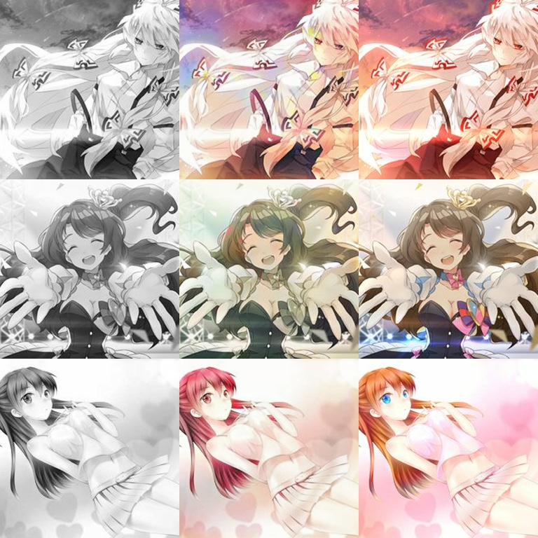

# Pix2Pix-Keras
基于pix2pix模型的动漫图片自动上色 2019-2-25
### 数据集的准备：
- 把训练的彩色图片放入datasets\OriginalImages文件夹
- 运行prepare.py进行数据集的处理与准备
- 注意：当前datasets中的训练集过少，可增加训练集进行训练，防止过拟合
### 训练模型：
- 若要加载预训练权重，将权重文件放入weights文件夹
- 最新权重下载地址：https://pan.baidu.com/s/1IUamednTkPE0qPw736Crzw
- 在demo.py中新建一个pix2pix模型实例
- 调用实例中的train函数进行训练
### 为新的图片上色:
- 将权重文件放入weights文件夹
- 新建一个pix2pix模型实例
- 调用demo.py中的predict_single_image函数进行图片上色
### Demo:

  
  
  
  
  
  

