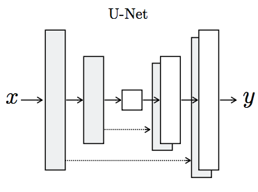
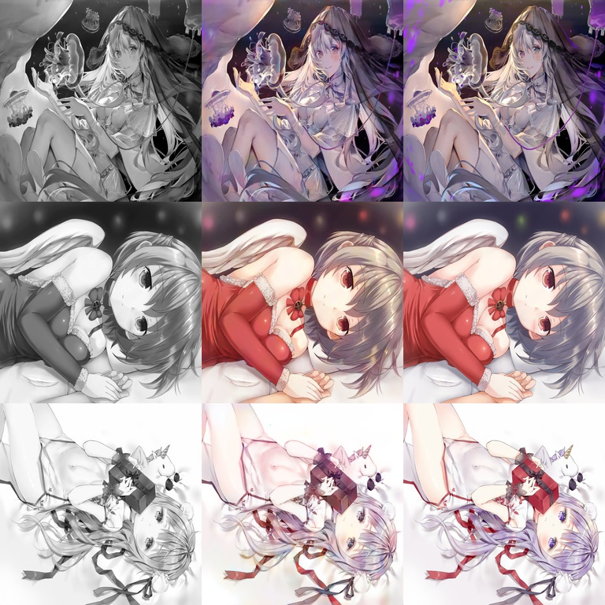
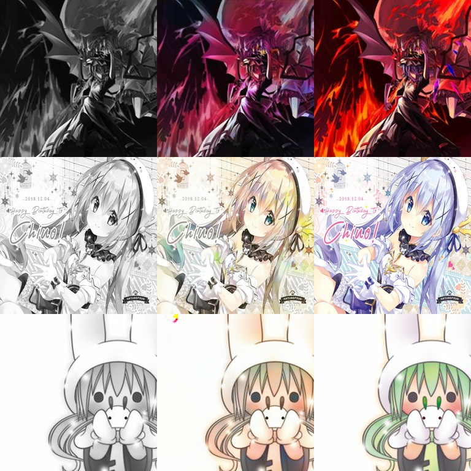
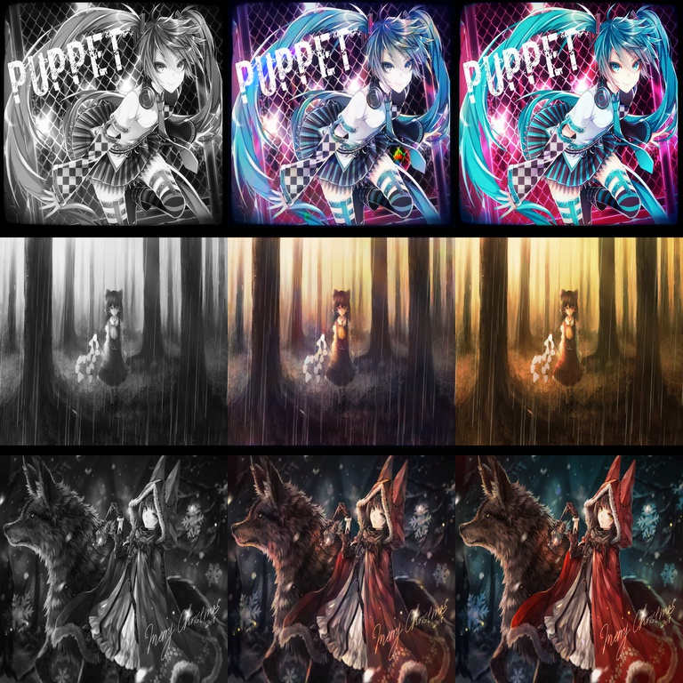
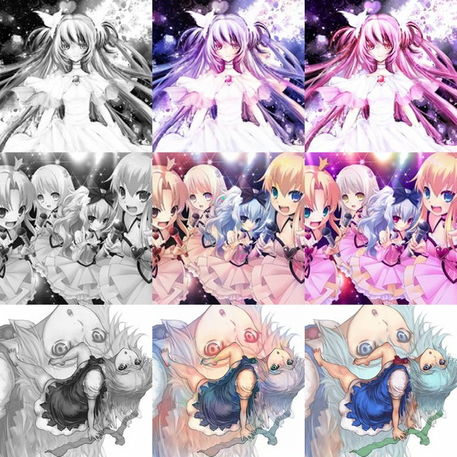
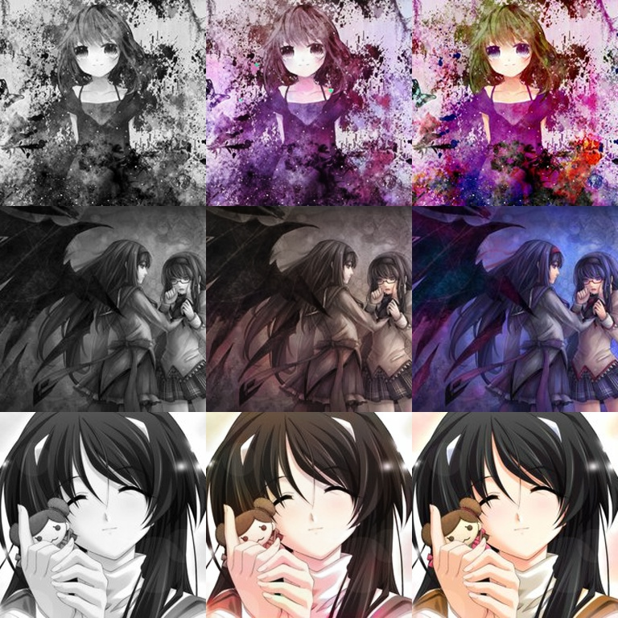
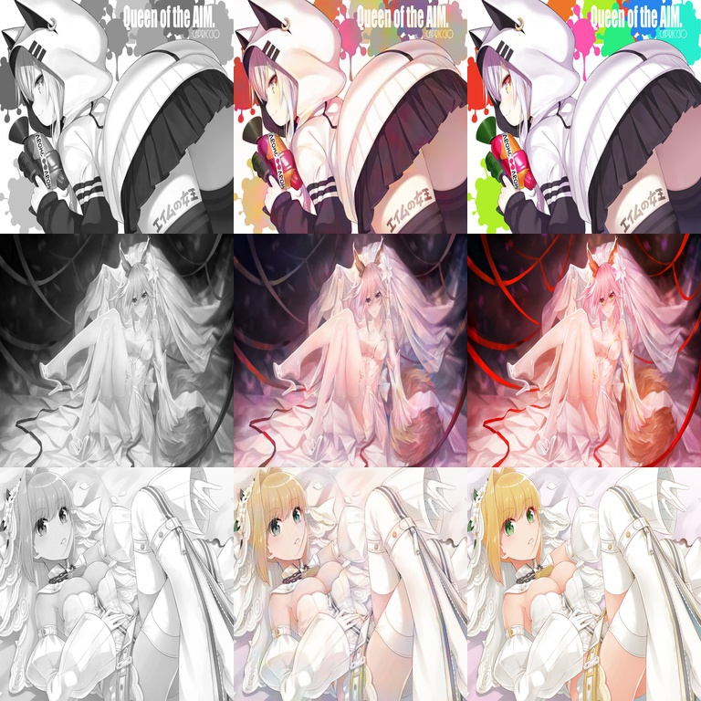
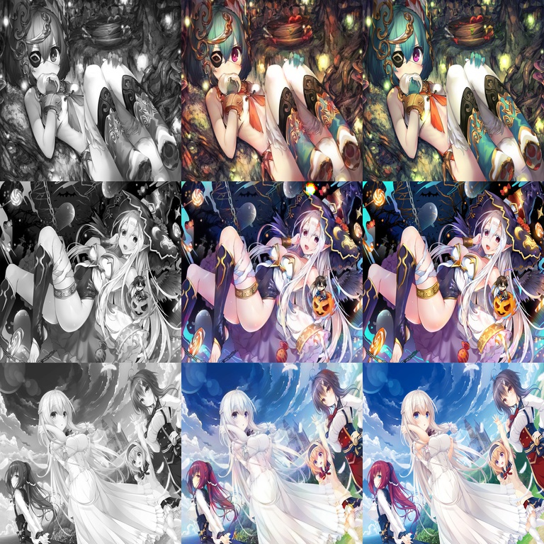
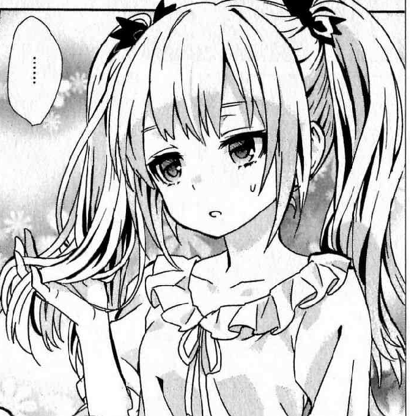
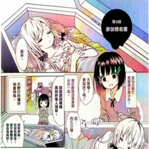

# Pix2Pix-Keras
基于pix2pix模型的动漫图片自动上色 2019-2-25
### 关于Generator:
##### 该模型的生成器与Generator与普通的GAN不同，使用了U-Net结构

  

### 训练模型：
1. 将权重文件放入weights文件夹
2. 在datasets中的320张图片进行训练后的权重下载地址：https://pan.baidu.com/s/1IUamednTkPE0qPw736Crzw
3. 在demo.py中新建一个pix2pix模型实例
4. 调用实例中的train函数进行训练
### 为新的图片上色:
1. 将权重文件放入weights文件夹
2. 新建一个pix2pix模型实例
2. 调用demo.py中的predict_single_image函数
### 注意：训练集较少，可增加训练集继续训练
### Demo(中间的为pix2pix模型生成图，右边的为原始图片):

### 泛化能力测试——为漫画上色测试：

  
  

